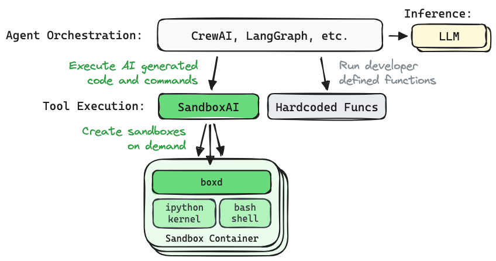

# SandboxAI

*Unleash your AI agents ... in a box!*

SandboxAI is an open source runtime for executing AI-generated Python code and shell commands inside dynamic containers.

* **Flexible control**
  * Full-agency - Set the agent loose within the container
  * Limited-agency - Give the agent access to specific commands
* **Container based**
  * You define the environment
  * Integrate with existing tooling
* **Pluggable backends**
  * Run on your local machine or a remote VM
  * Run on your Kubernetes cluster (coming soon)
* **Open REST API**
  * Use the official Python or Go client
  * Generate your own client from the API spec

## Where does it fit?

SandboxAI was designed to fit nicely into your AI software stack.



## Quickstart

Make sure you have docker installed.

<details>
<summary>TIP: Free alternatives to docker desktop...</summary>

* On a mac? Checkout [colima](https://github.com/abiosoft/colima).
* On linux? Use [docker engine](https://docs.docker.com/engine/install/).
</details>

```bash
docker ps
```

Install the python client.

```bash
pip install sandboxai-client
```

Run a sandbox on your local machine.

```python
from sandboxai import Sandbox

with Sandbox(embedded=True) as box:
    print(box.run_ipython_cell("print('hi')"))
    print(box.run_shell_command("ls /"))
```

## Contributing

We welcome contributions to SandboxAI. See the [contributing doc](contributing.md) for more information.

## Contact

Let us know about features you are interested in seeing or reach out with questions. [Visit our Discord channel](https://discord.gg/JeXhcmjZVm) to join the discussion!

Or just reach out on LinkedIn if you want to connect:

* [Nick Stogner](https://www.linkedin.com/in/nstogner/)
* [Sam Stoelinga](https://www.linkedin.com/in/samstoelinga/)
